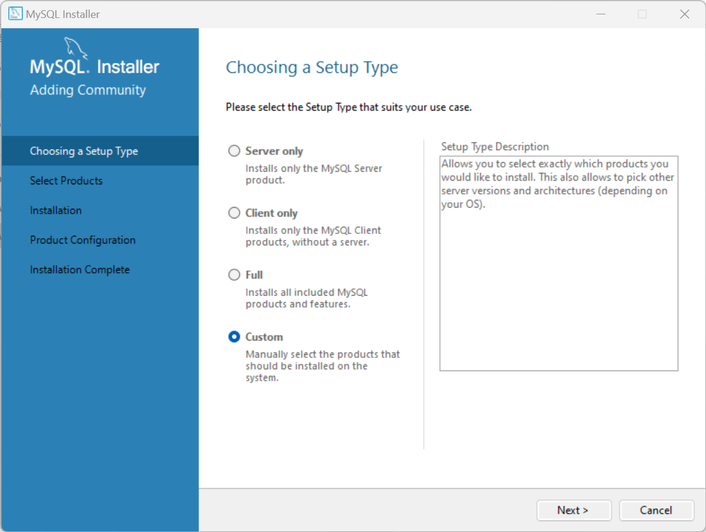
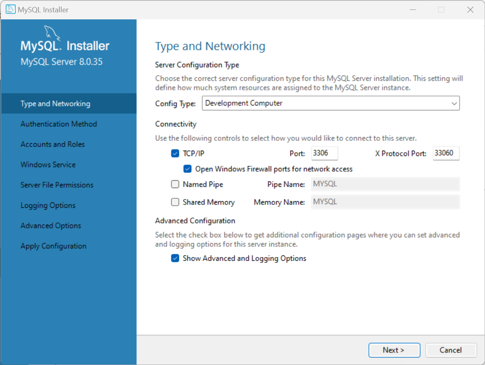
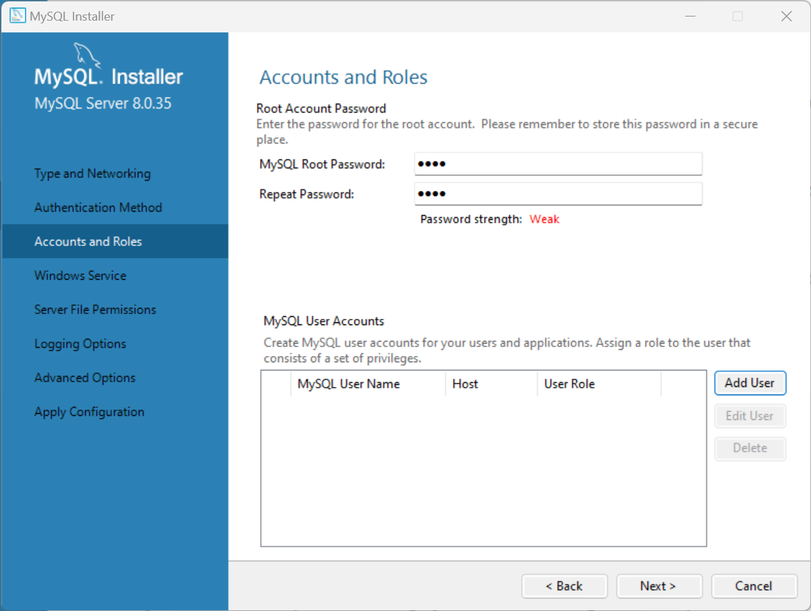
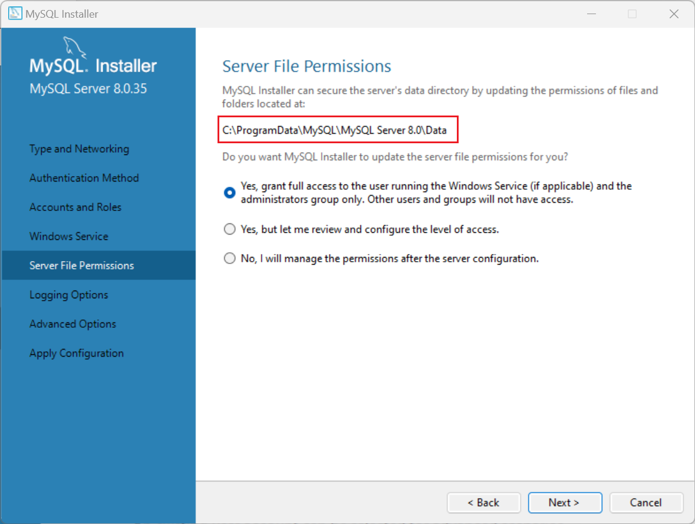
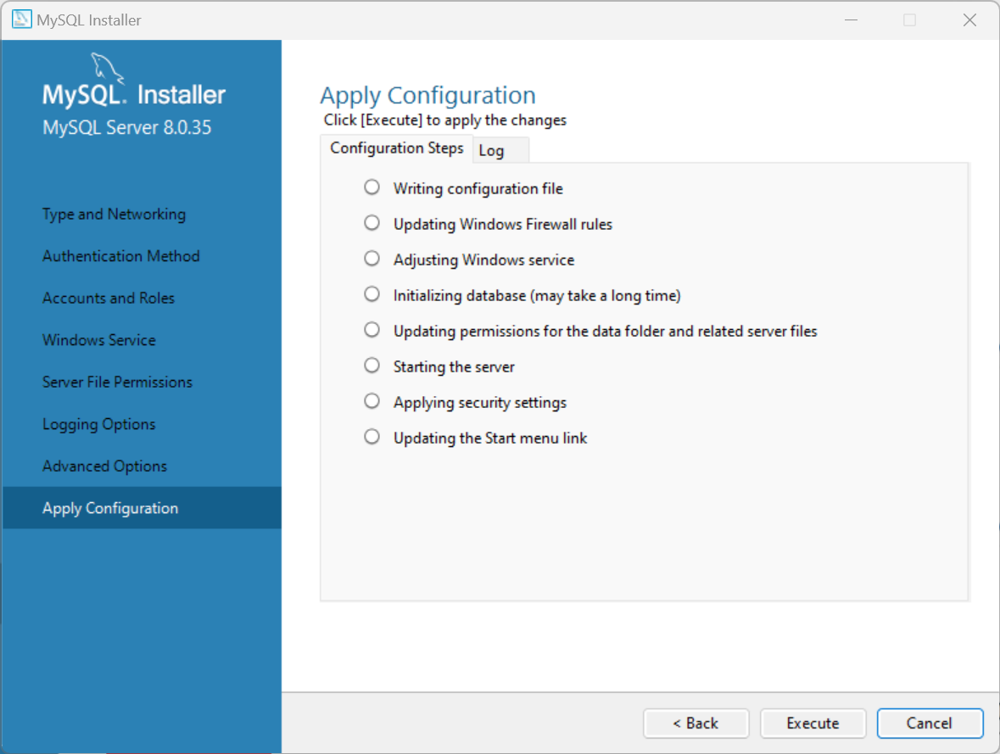
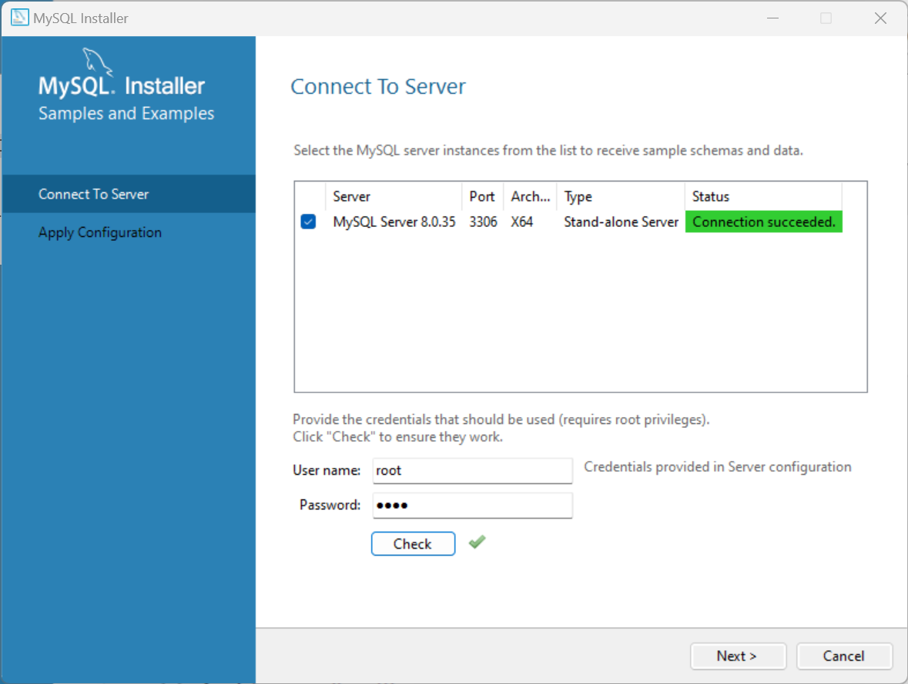

## MySQL安装

## 使用Docker安装MySQL

> Docker Hub：https://hub.docker.com/_/mysql

**1.下载镜像**

`docker pull mysql:8`

**2.创建容器**

2.1 准备mysql配置目录、配置文件、数据目录、日志目录

`mkdir -p /docker/mysql8/conf/conf.d`

`touch /docker/mysql8/conf/my.cnf`

```
# mysql
```

`mkdir -p /docker/mysql8/data`

`mkdir -p /docker/mysql8/logs`

2.2 创建容器

`docker create --name mysql8 --restart=always -p 3306:3306 -v /docker/mysql8/conf:/etc/mysql -v /docker/mysql8/data:/var/lib/mysql -v /docker/mysql8/logs:/var/log/mysql -e MYSQL_ROOT_PASSWORD=root mysql:8`

参数说明：

- `--name mysql8`：容器名称
- `--restart=always`：异常退出后，自动重启
- `-p 3306:3306`：主机与容器端口映射
- `-v /docker/mysql8/conf:/etc/mysql`：挂载mysql配置目录
- `-v /docker/mysql8/data:/var/lib/mysql`：挂载mysql数据目录
- `-v /docker/mysql8/logs:/var/log/mysql`：挂载mysql日志目录
- `-e MYSQL_ROOT_PASSWORD=root`：root用户密码

**3.启动容器**

`docker start mysql8`

**4.验证**

查看日志：`docker logs mysql8`

进入容器：`docker exec -it mysql8 bash`

登录MySQL：`mysql -u root -p`

## Unix、Linux中使用二进制文件安装MySQL

参考：https://dev.mysql.com/doc/refman/8.0/en/installing.html

## Windows中使用Installer包安装MySQL

下载：https://dev.mysql.com/downloads/installer/

**1.选择安装方式**

选择自定义



**2.选择要安装的产品**

除了MySQL Server是必选的外，其它的都是可选


**3.安装**


**4.产品配置**


**4.1 选择服务器配置类型和网络**



**4.2 选择密码认证方式**


**4.3 设置用户和密码**



**4.4 设置MySQL作为Windows服务开机自启动**


**4.5 设置MySQL服务器文件权限**



**4.6 选择允许MySQL保存的日志**

错误日志、普通日志、慢查询日志、Binary日志


**4.7 应用配置**



**5.测试连接到MySQL服务器**

输入root用户密码，check一下



应用配置


**6.安装完成**


**7.添加其它MySQL工具**

安装完成之后，如果想要安装其它工具，或者已安装工具的其它版本，只需要重新启动Installer，选择要添加的工具，进行安装即可


**设置PATH环境变量**

将MySQL Server安装目录下的bin添加到PATH环境变量，默认安装位置在 C:\Program Files\MySQL\MySQL Server 8.0

在CMD中连接MySQL服务器

