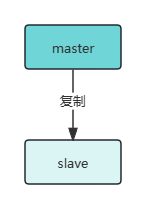
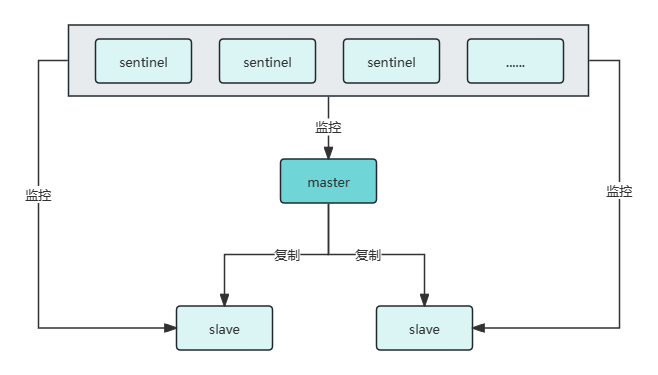

## 数据迁移

### `move`

`move`命令适用于在单个Redis实例中，将key从当前数据库移动到另一个数据库。

示例：

```sh
# 将hello键值对从当前数据库移动到数据库1
move hello 1
```

### `dump` + `restore`

`dump`命令将1个key的值序列化为RDB格式的序列，`restore`命令从RDB序列中恢复key的值。

组合2个命令可实现在不同Redis实例之间进行数据迁移。

示例：

```sh
# 在一个Redis中，序列换键hello的值
dump hello

# 在另一个Redis中，从序列中恢复值。键过期时间为0，表示不设置过期时间
restore hello 0 "\x00\x05world\x0b\x00p\x0e\x81\xf7-6\x9bK"
```

### `migrate`

`migrate`命令用于在不同Redis实例之间迁移数据。语法如下：

```sh
migrate host port key|"" destination-db timeout [COPY] [REPLACE] [AUTH password|AUTH2 username password] [KEYS key [key ...]]
```

参数说明：

- `host`：目标Redis实例IP
- `port`：目标Redis实例端口
- `key|""`：如果迁移1个键，则写键名；否则，写空字符串
- `destination-db`：目标Redis实例数据库
- `timeout`：超时时间，单位毫秒
- `[COPY]`：可选，迁移后不删除源key
- `[REPLACE]`：可选，如果目标Redis实例中存在同名的key，直接替换
- `[AUTH password|AUTH2 username password]`：可选，目标Redis的用户名和密码
- `[KEYS key [key ...]]`：可选，迁移多个键时，指定键列表

## 数据持久化机制

Redis 提供了两种主要的持久化方式，分别是 RDB（Redis DataBase）和 AOF（Append Only File）。这两种方式可以单独或同时使用。

### RDB: 保存快照

RDB（Redis Database），是一种快照持久化方式，将内存中的数据保存到磁盘上的二进制文件中，Redis重启时用RDB文件恢复数据。

RDB文件保存Redis在某个时间点的数据，其优点是快速、文件紧凑，适合备份大规模数据；缺点是无法做到实时持久化，会丢失最后一次快照之后的所有数据。

**手动触发RDB吃计划**

执行`save` 或 `bgsave`命令。

另外，执行`shutdown`命令关闭Redis服务器时，也会自动执行`bgsave`命令

**自动触发RDB持久化**

```
dir ./
dbfilename dump.rdb

# save <seconds> <changes> [<seconds> <changes> ...]
save 3600 1 300 100 60 10000

# 禁用RDB自动持久化
# save ""
```

### AOF: 只追加文件

AOF（Append Only File），是一种日志持久化方式，将每一个写命令追加到日志文件末尾，记录数据库的变更记录，Redis重启时重写执行AOF日志文件中的命令来恢复数据。

开启AOF后，Redis重启时，优先加载AOF持久化文件。

AOF持久化方式的优点是数据完整性高、适合增量更新；缺点是AOF文件较大、且恢复数据较慢。

**配置项**

```
# 开启AOF
appendonly yes

appendfilename "appendonly.aof"
appenddirname "appendonlydir"

# 写入磁盘的策略
# appendfsync always
appendfsync everysec
# appendfsync no

# 自动触发AOF重写: aof文件至少为64mb，且达到上次重写时aof文件大小的100%
auto-aof-rewrite-percentage 100
auto-aof-rewrite-min-size 64mb
```

通过AOF重写，可以减小AOF文件的大小，通过以下2个配置项自动触发AOF重写：

- `auto-aof-rewrite-percentage`：AOF文件达到上次重写后文件大小的百分比
- `auto-aof-rewrite-min-siz`：AOF文件至少多大时，才触发重写。默认64mb

另外，可以通过命令`bgrewriteaof`，手动触发AOF重写。

## 主从复制机制

> 参考：https://redis.io/docs/management/replication/

Redis复制（Replication）是指将master服务器的数据同步到slave服务器的架构。主从复制步骤如下：

1. 从节点连接到主节点，主节点发送全量数据给从节点
2. 从节点监听来自主节点的写操作，主节点将写操作发送给从节点，从节点执行同样的写操作，从而实现数据的增量更新
3. 从节点重新上线后，会重新向主节点请求全量数据

Redis主从复制的优点包括：

- 提高了系统的可用性和容错性
- 支持读写分离；

Redis主从复制的缺点包括：

- 主从复制是异步执行，存在延迟问题
- 存在主服务器的单点故障问题

使用命令：`info replication` 查看主从服务信息。

### 主从复制的拓扑结构

#### 一主一从

1个master实例、1个slave实例。当主节点故障时，可以将从节点升级为主节点。



#### 一主多从

1个master实例、多个slave实例。主节点负责写、从节点负责读，可实现读写分离。


#### 树状

slave实例也可以同时充当master实例的角色。从节点既可以复制主节点的数据，也可作为主节点，向下层从节点复制数据，降低主节点的写操作压力。


### 快速开始

#### 环境准备

"一主多从"拓扑结构为例：采用1台master服务器+2台slave服务的架构，用docker创建Redis容器。

**创建3个Redis容器**

拉取镜像：`docker pull redis:7`

master实例

```sh
mkdir -p /docker/redis7/conf/
touch /docker/redis7/conf/redis.conf

docker create --name redis7 -p 6379:6379 -v /docker/redis7/conf:/etc/redis -v /docker/redis7/data:/data redis:7 redis-server /etc/redis/redis.conf
```

slave实例a

```sh
mkdir -p /docker/redis7a/conf/
touch /docker/redis7a/conf/redis.conf

docker create --name redis7a -p 6377:6379 -v /docker/redis7a/conf:/etc/redis -v /docker/redis7a/data:/data redis:7 redis-server /etc/redis/redis.conf
```

slave实例b

```sh
mkdir -p /docker/redis7b/conf/
touch /docker/redis7b/conf/redis.conf

docker create --name redis7b -p 6378:6379 -v /docker/redis7b/conf:/etc/redis -v /docker/redis7b/data:/data redis:7 redis-server /etc/redis/redis.conf
```

每个Redis实例的基础配置文件如下：

```
# redis.conf

# bind 127.0.0.1 -::1
port 6379
# 开启保护模式
protected-mode yes
# 密码
requirepass foobared

# RDB持久化配置
# save 3600 1 300 100 60 10000
dbfilename dump.rdb
# dir ./
dir /data

# AOF持久化配置
appendonly no
appendfilename "appendonly.aof"
# appendfsync always
appendfsync everysec
# appendfsync no

auto-aof-rewrite-percentage 100
auto-aof-rewrite-min-size 64mb
```

#### 配置slave实例

在2台slave实例的配置文件中，配置master实例的IP、端口、认证信息。

```
# replicaof <masterip> <masterport>
replicaof 172.17.0.2 6379

# masterauth <master-password>
masterauth foobared

# masteruser <username>

# 从节点只读
replica-read-only yes

# 是否禁用主节点无延迟发送TCP数据包
repl-disable-tcp-nodelay no
```

#### 启动Redis实例

1.启动master实例

`docker start redis7`

2.启动2台slave实例

`docker start redis7a redis7b`

此时，查看master实例的日志，可以看到，2台slave实例成功连接到了master实例

`docker logs redis7`


#### 验证

在master实例中，设置键值对"hello=world"


在2台slave实例中，查看键"hello"的值，成功获取到"world"


### 使用命令指定主从关系

使用`slaveof`命令，语法如下：

`SLAVEOF <host port | NO ONE>`

可以临时指定当前Redis实例作为slave

`slaveof 172.17.0.2 6379`

或者，取消主从关系（成为master）

`slaveof no one`

## 哨兵模式

> 参考：https://redis.io/docs/management/sentinel/

Redis哨兵（Redis Sentinel）可以监控主从架构中的Redis数据节点实例，当master实例故障时，自动选举1个slave实例，将其升级为新的master实例，实现自动故障发现与转移，确保系统的高可用与容错性。

Redis本身可以使用sentinel模式运行，支持以下2种启动方式：

- `redis-sentinel /path/to/sentinel.conf`
- `redis-server /path/to/sentinel.conf --sentinel`

Redis哨兵数量为奇数，且推荐哨兵数量不少于3个。

典型的"哨兵+主从复制"拓扑图如下：



### 快速开始

#### 环境准备

使用3个Sentinel节点 + 1个master数据节点 + 2个slave数据节点的架构。

其中，数据节点使用主从复制时创建的docker容器。

**创建3个docker容器作为Redis哨兵**

> 哨兵节点端口为26379

哨兵实例x

```
mkdir -p /docker/redis7-sentinel-a/conf/
touch /docker/redis7-sentinel-a/conf/sentinel.conf

docker create --name redis7-sentinel-a -p 26370:26379 -v /docker/redis7-sentinel-a/conf:/etc/redis -v /docker/redis7-sentinel-a/data:/data redis:7 redis-sentinel /etc/redis/sentinel.conf
```

哨兵实例y

```
mkdir -p /docker/redis7-sentinel-b/conf/
touch /docker/redis7-sentinel-b/conf/sentinel.conf

docker create --name redis7-sentinel-b -p 26371:26379 -v /docker/redis7-sentinel-b/conf:/etc/redis -v /docker/redis7-sentinel-b/data:/data redis:7 redis-sentinel /etc/redis/sentinel.conf
```

哨兵实例z

```
mkdir -p /docker/redis7-sentinel-c/conf/
touch /docker/redis7-sentinel-c/conf/sentinel.conf

docker create --name redis7-sentinel-c -p 26372:26379 -v /docker/redis7-sentinel-c/conf:/etc/redis -v /docker/redis7-sentinel-c/data:/data redis:7 redis-sentinel /etc/redis/sentinel.conf
```

#### 配置哨兵实例

在每一个哨兵节点的*sentinel.conf*配置文件中，配置哨兵监听的主节点IP、端口、**判定主节点故障所需要的票数**，以及主节点的认证信息等。

如果哨兵要同时监控多个主节点，只需要添加主节点名称不同的配置即可。

```
# bind 127.0.0.1
port 26379

protected-mode no

# 配置master实例
sentinel monitor mymaster 172.17.0.2 6379 2
# sentinel auth-user <master-name> <username>
sentinel auth-pass mymaster foobared

# 判定节点下线的超时时间，默认30s
sentinel down-after-milliseconds mymaster 30000
# 当选出新的主节点后，允许同时向主节点发起复制操作的从节点数量
sentinel parallel-syncs mymaster 1
sentinel failover-timeout mymaster 180000
```

#### 启动哨兵实例

先启动Redis主从节点

`docker start redis7a redis7b redis7c`

再启动哨兵节点

`docker start redis7-sentinel-a redis7-sentinel-b redis7-sentinel-c`

#### 验证

进入任意一个哨兵节点容器

`docker exec -it redis7-sentinel-a redis-cli -p 26379`

运行 `info sentinel`命令，查看哨兵信息

关闭主节点

`docker stop redis7`

查看主从节点信息

`info replication`

## 集群

### 搭建集群

#### 1.准备节点

#### 2.节点握手

`cluster meet ip port`

#### 3.给每个主节点分配槽

将16384（0-16383）个槽分配给集群中的主节点。

`cluster addslots 0-5000`

#### 4.为每个从节点设置要复制的主节点

`cluster replicate node-id`

