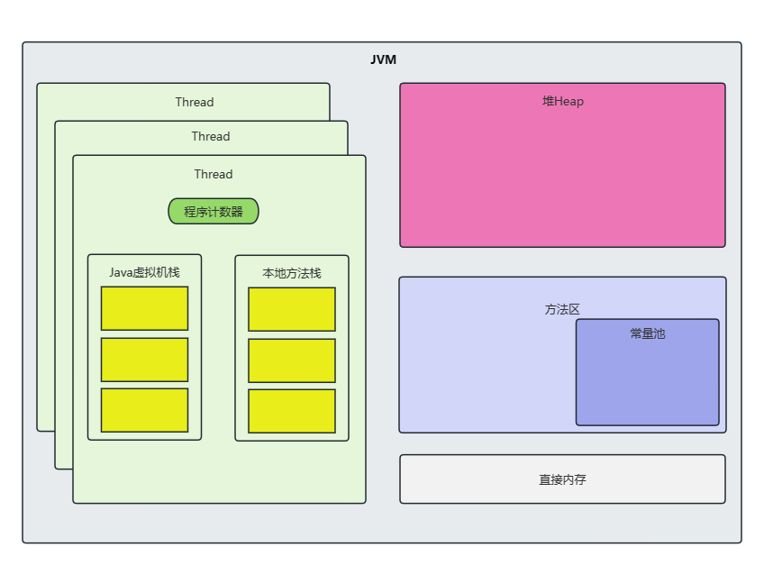

JVM内存模型如下图所示：

## 程序计数器

程序计数器（Program Counter Register），线程私有，用于指示下一条要执行的指令地址。

## Java虚拟机栈

Java虚拟机栈（Java Virtual Machine Stacks），线程私有，用于存放Java方法的局部变量（基本类型数据，对象引用等）、操作数栈、动态链接、方法出口等信息。

## 本地方法栈

本地方法栈（Native Method Stacks），线程私有，类似于Java虚拟机栈，用于支持调用本地方法。

## Java堆

Java堆（Java Heap），属于线程共享区域，用于存放Java对象实例。

## 方法区

方法区（Method Area），属于线程共享区域，用于存放类信息、常量、静态变量等信息。

## 运行时常量池

运行时常量池（Runtime Constant Pool），属于方法区的一部分，存放编译期生成的字面量和符号引用。

## 直接内存

直接内存（Direct Memory），不属于Java虚拟机规范中的一部分，通过调用本地方法直接分配的内存。

