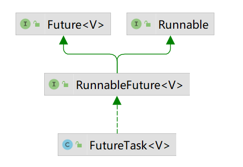

## 继承`Thread`类

1.继承`Thread`类，重写`run`方法

```java
public class MyThread extends Thread {
    @Override
    public void run() {
        Thread t = Thread.currentThread();
        System.out.println(t.getName());
    }
}
```

2.创建`Thread`，启动线程

```java
public static void main(String[] args) {
    Thread t = new MyThread();
    t.start();
}
```

## 实现`Runnable`接口

1.实现`Runnable`接口，重写`run`方法

```java
public class MyRunnable implements Runnable {
    @Override
    public void run() {
        Thread t = Thread.currentThread();
        System.out.println(t.getName());
    }
}
```

2.创建`Thread`，将`Runnable`实现类对象作为参数传递进去

```java
public static void main(String[] args) {
    Runnable target = new MyRunnable();
    Thread t = new Thread(target);
    t.start();
}
```

也可以使用匿名内部类的方式创建`Runnable`对象

```java
Runnable target = new Runnable() {
    @Override
    public void run() {
        System.out.println(Thread.currentThread().getName());
    }
};
```

`Runnable`是函数式接口，也可以使用lambda表达式的方式

```java
Runnable target = ()-> System.out.println(Thread.currentThread().getName());
```

## 实现`Callable<V>`接口

通过`Callable<V>`接口的方式创建线程，可以获取子线程的返回值。

1.实现`Callable<V>`接口，重写`call`方法

```java
public class MyCallable implements Callable<Integer> {
    @Override
    public Integer call() throws Exception {
        System.out.println("MyCallable#call");
        return 0;
    }
}
```

2.创建`FutureTask<V>`对象，接收`Callable<V>`类型的构造器参数；

3.创建`Thread`，接收`FutureTask<V>`类型的构造器参数

```java
public static void main(String[] args) {
    Callable<Integer> callable = new MyCallable();
    FutureTask<Integer> task = new FutureTask<>(callable);
    Thread t = new Thread(task);
    t.start();
}
```

`FutureTask<V>`类的UML类图如下，间接的实现了`Runnable`接口，所以可以作为`Thread`构造方法参数



4.获取子线程的返回值

```java
try {
    Integer outcome = task.get();
    System.out.println(outcome);
} catch(InterruptedException | ExecutionException e) {
    e.printStackTrace();
}
```

## 线程池

### 线程池核心API

线程池核心类的UML类图如下：


#### `Executor`

`Executor`接口定义了1个提交任务的方法

```java
public interface Executor {
    void execute(Runnable command);
}
```

#### `ExecutorService`

`ExecutorService`接口继承`Executor`接口，新增了用于关闭线程池的方法，以及其它几种提交任务的方法

```java
public interface ExecutorService extends Executor {
    // 关闭线程池: 等待已提交的任务执行完成, 但不再接受新提交的任务
    void shutdown();
    
    // 关闭线程池: 终止正在执行的任务, 终止等待中的任务, 并返回等待执行的任务列表
    List<Runnable> shutdownNow();
    
    // 阻塞: 直到所有任务终止、超时、或者抛出InterruptedException
    boolean awaitTermination(long timeout, TimeUnit unit) throws InterruptedException;
    
    // 提交任务, 线程返回值为Callable.call()的返回值
    <T> Future<T> submit(Callable<T> task);
    // 提交任务, 线程返回值为默认值result
    <T> Future<T> submit(Runnable task, T result);
    // 提交任务, 线程返回值为null
    Future<?> submit(Runnable task);
    
    // 批量提交任务, 等到所有任务执行完成时(或者任务超时), 返回Future列表
    <T> List<Future<T>> invokeAll(Collection<? extends Callable<T>> tasks) throws InterruptedException;
    <T> List<Future<T>> invokeAll(Collection<? extends Callable<T>> tasks, long timeout, TimeUnit unit) throws InterruptedException;
    
    // 批量提交任务, 返回成功完成的任一任务的结果, 其它任务将被取消
    <T> T invokeAny(Collection<? extends Callable<T>> tasks) throws InterruptedException, ExecutionException;
    <T> T invokeAny(Collection<? extends Callable<T>> tasks, long timeout, TimeUnit unit)
        throws InterruptedException, ExecutionException, TimeoutException;
}
```

#### `AbstractExecutorService`

`AbstractExecutorService`抽象类实现了`ExecutorService`接口，提供了提交任务方法的默认实现，以及取消任务的方法

```java
public abstract class AbstractExecutorService implements ExecutorService {
    // ...
}
```

#### `ThreadPoolExecutor`

`ThreadPoolExecutor`继承自`AbstractExecutorService`，是线程池的实现类，用来创建线程池

```java
public class ThreadPoolExecutor extends AbstractExecutorService {
    // ...
}
```

#### `ScheduledExecutorService`

`ScheduledExecutorService`接口继承`ExecutorService`接口，新增了几个用于执行延时任务和周期任务的方法

````java
public interface ScheduledExecutorService extends ExecutorService {
    // 提交任务: 延迟执行的一次性任务
    public ScheduledFuture<?> schedule(Runnable command, long delay, TimeUnit unit);
    public <V> ScheduledFuture<V> schedule(Callable<V> callable, long delay, TimeUnit unit);
    
    // 提交任务: 在给定的初始延迟后首次执行; 然后开始周期执行(两次执行开始的时间有固定的间隔)
    public ScheduledFuture<?> scheduleAtFixedRate(Runnable command, long initialDelay, long period, TimeUnit unit);
    
    // 提交任务: 在给定的初始延迟后首次执行；然后开始循环执行(一次执行完成后和下次执行开始之间, 有固定的延迟)
    public ScheduledFuture<?> scheduleWithFixedDelay(Runnable command, long initialDelay, long delay, TimeUnit unit);
}
````

#### `ScheduledThreadPoolExecutor`

`ScheduledThreadPoolExecutor`类继承自`ThreadPoolExecutor`，并实现了`ScheduledExecutorService`接口，用来创建可以执行延迟任务或周期任务的线程池

```java
public class ScheduledThreadPoolExecutor extends ThreadPoolExecutor implements ScheduledExecutorService {
    // ...
}
```

### `Executors`工具类

`Executors`工具类中定义了一些创建线程池的快捷方法：

- `ExecutorService newFixedThreadPool(int nThreads)`，创建固定大小的线程池
- `ExecutorService newSingleThreadExecutor()`，创建只有1个线程的线程池
- `ExecutorService newCachedThreadPool()`，创建可缓存的线程池（核心线程数为0，最大线程数无限制，非核心空闲线程存活时间为60s）
- `ScheduledExecutorService newScheduledThreadPool(int corePoolSize)`，创建可执行延迟任务和周期任务的线程池
- `ScheduledExecutorService newSingleThreadScheduledExecutor()`，创建可执行延迟任务和周期任务的线程池，只有1个线程
- `ExecutorService newWorkStealingPool(int parallelism)`，创建Fork-Join线程池

还提供了`ThreadFactory`的默认实现，以及返回默认实现的方法

```java
public static ThreadFactory defaultThreadFactory() {
    return new DefaultThreadFactory();
}
```

还提供了返回`Callable<V>`对象的方法：

- `Callable<T> callable(Runnable task, T result)`
- `Callable<Object> callable(Runnable task)`

使用`Executors`工具类创建线程池示例

```java
public static void main(String[] args) {
    DateFormat dtf = new SimpleDateFormat("HH:mm:ss.ms");
    Runnable task = () -> {
        String name = Thread.currentThread().getName();
        String date = dtf.format(System.currentTimeMillis());
        System.out.printf("%s: %s%n", name, date);
    };

    ExecutorService executor = Executors.newFixedThreadPool(3);

    // 提交并执行10个Runnable任务
    for(int i = 0; i < 10; i++) {
        executor.execute(task);
    }
    executor.shutdown();
}
```

### 使用`ThreadPoolExecutor`创建线程池

`ThreadPoolExecutor`构造器有多个重载版本，完整参数的构造器如下

```java
public ThreadPoolExecutor(int corePoolSize,
                          int maximumPoolSize,
                          long keepAliveTime,
                          TimeUnit unit,
                          BlockingQueue<Runnable> workQueue,
                          ThreadFactory threadFactory,
                          RejectedExecutionHandler handler) {
    // ...
}
```

构造器参数：

- corePoolSize，核心线程数，这些线程即使处于空闲状态，也不会被回收，除非调用方法`allowCoreThreadTimeOut(true)`设置允许核心线程超时
- maximumPoolSize，最大线程数
- keepAliveTime，Idle线程存活时间
- unit，Idle线程存活时间的单位
- workQueue，工作队列，保存通过`execute`方法提交的`Runnable`任务
- threadFactory，线程工厂
- handler，线程池无法处理新任务时的拒绝策略（工作队列已满且线程数达到maximumPoolSize、线程池已关闭等）

当提交新任务到线程池时：

1. 如果工作线程数小于核心线程数，则创建新线程执行任务
2. 如果工作线程数大于等于核心线程数，且工作队列未满，则将任务添加到工作队列中
3. 如果工作线程数大于等于核心线程数、工作队列已满，且工作线程数小于最大线程数，则创建新线程执行任务
4. 如果工作线程数大于等于核心线程数、工作队列已满，且工作线程数等于最大线程数，则执行线程池拒绝策略 

创建线程池示例：

```java
// 创建一个线程池，可以同时处理的最大任务数为30(最大线程数10 + 工作队列容量20)
ThreadPoolExecutor pool = new ThreadPoolExecutor(
    5,
    10,
    60L,
    TimeUnit.SECONDS,
    new LinkedBlockingQueue<>(20),
    Executors.defaultThreadFactory(),
    new ThreadPoolExecutor.AbortPolicy());

// 任务总数为200
for(int i = 0; i < 200; i++) {
    // 每隔10ms, 提交1个任务
    try {
        TimeUnit.MILLISECONDS.sleep(50L);
    } catch(InterruptedException e) {
        e.printStackTrace();
    }

    final int iTemp = i;
    pool.execute(() -> {
        // 每个任务执行耗时200ms
        try {
            TimeUnit.MILLISECONDS.sleep(500L);
        } catch(InterruptedException e) {
            e.printStackTrace();
        }
        System.out.printf("%s: 任务总数=%d, 运行中的任务数=%d, i=%d%n",
                          Thread.currentThread().getName(), pool.getTaskCount(), pool.getActiveCount(), iTemp);
    });
}
pool.shutdown();
```

### 使用`ScheduledThreadPoolExecutor`创建线程池

`ScheduledThreadPoolExecutor`完整参数的构造器如下：

```java
public ScheduledThreadPoolExecutor(int corePoolSize,
                                   ThreadFactory threadFactory,
                                   RejectedExecutionHandler handler) {
    super(corePoolSize, Integer.MAX_VALUE,
          DEFAULT_KEEPALIVE_MILLIS, MILLISECONDS,
          new DelayedWorkQueue(), threadFactory, handler);
}
```

创建线程池示例：

```java
ScheduledExecutorService pool = new ScheduledThreadPoolExecutor(
    2,
    Executors.defaultThreadFactory(),
    new ThreadPoolExecutor.AbortPolicy());

Runnable task = () -> System.out.println(Thread.currentThread().getName());
pool.scheduleAtFixedRate(task, 3, 1, TimeUnit.SECONDS);
```

### 线程池线程工厂

`ThreadFactory`线程工厂接口，定义了用于创建线程的方法

```java
public interface ThreadFactory {
    Thread newThread(Runnable r);
}
```

`Executors`工具类中，提供了线程工厂接口的默认实现`DefaultThreadFactory`，以及返回线程工厂默认实现的静态方法：

```java
public class Executors {
    public static ThreadFactory defaultThreadFactory() {
        return new DefaultThreadFactory();
    }
    
    // ...
}
```

自定义线程工厂

```java
public class MyThreadFactory implements ThreadFactory {
    private static final AtomicInteger poolNumber = new AtomicInteger(1);
    private final ThreadGroup group;
    private final AtomicInteger threadNumber = new AtomicInteger(1);
    private final String namePrefix;

    public MyThreadFactory() {
        group = new ThreadGroup("分组");
        namePrefix = "线程池" + poolNumber.getAndIncrement() + "-线程";
    }

    @Override
    public Thread newThread(Runnable r) {
        Thread t = new Thread(group, r, namePrefix + threadNumber.getAndIncrement(), 0);
        t.setDaemon(false);
        t.setPriority(Thread.NORM_PRIORITY);
        return t;
    }
}
```

### 线程池工作队列

`BlockingQueue<E>`阻塞队列接口，有下面几种实现类：

- `ArrayBlockingQueue<E>`
- `LinkedBlockingQueue<E>`
- `PriorityBlockingQueue<E>`
- `DelayQueue<E extends Delayed>`
- `SynchronousQueue<E>`

### 线程池拒绝策略

当提交到线程池的任务数超过最大线程数和工作队列容量之和时，或者线程池已关闭时，线程池拒绝策略生效。

使用`RejectedExecutionHandler`接口表示拒绝策略

```java
public interface RejectedExecutionHandler {
    void rejectedExecution(Runnable r, ThreadPoolExecutor executor);
}
```

在`ThreadPoolExecutor`类中，以静态内部类的方式，定义了几个拒绝策略实现类：

- `AbortPolicy`，拒绝任务，并抛出`RejectedExecutionException`异常。默认策略。
- `DiscardPolicy`，直接丢弃任务，不做任何处理
- `DiscardOldestPolicy`，丢弃最老任务，然后再次尝试提交新任务
- `CallerRunsPolicy`，调用者执行策略，如果任务提交被拒绝，就在调用者线程运行任务

自定义线程池拒绝策略

```java
public class MyRejectedExecutionHandler implements RejectedExecutionHandler {
    @Override
    public void rejectedExecution(Runnable r, ThreadPoolExecutor executor) {
        System.out.printf("拒绝任务:, 任务总数=%d, 线程数量=%d, 运行任务数=%d%n",
                executor.getTaskCount(), executor.getPoolSize(), executor.getActiveCount());
    }
}
```

### 线程池的状态与关闭

线程池有5种状态：

1. RUNNING，线程池刚创建时，状态为RUNNING
2. SHUTDOWN，线程池调用`shutdown()`，状态由RUNNING转换为SHUTDOWN
3. STOP，线程池调用`shutdownNow()`，状态由RUNNING或SHUTDOWN转换为STOP
4. TIDYING，线程池中的工作线程全部停止、工作队列全部清空时，状态转换为TIDYING
5. TERMINATED，线程池状态是TIDYING后，会自动执行`terminated()`回调方法，状态转换为TERMINATED

`shutdown()` 和 `shutdownNow()` 方法都是立即返回，如果需要等待线程池关闭完成，需要使用`awaitTermination()`方法。

关闭线程池示例：

```java
private static void shutdown(ExecutorService pool){
    // 如果线程池已关闭, 直接返回
    if(pool.isTerminated()){
        return;
    }
    // 调用shutdown关闭线程池: 等待已提交的任务执行完毕, 不再接受新任务
    pool.shutdown();
    try {
        // 等待线程池关闭, 等待60s
        boolean terminated = pool.awaitTermination(60L, TimeUnit.SECONDS);
        // 已关闭, 直接返回
        if(terminated){
            return;
        }
        // 未关闭, 调用shutdownNow关闭线程池
        for(int i = 0; i < 1000; i++) {
            terminated = pool.awaitTermination(10L, TimeUnit.MILLISECONDS);
            if(terminated){
                break;
            }
            pool.shutdownNow();
        }
    } catch(InterruptedException e) {
        e.printStackTrace();
        pool.shutdownNow();
    }
}
```

## Fork-Join模式

待续...

## `CompletableFuture`

### 获取`CompletableFuture`实例

使用`runAsync`静态方法，传递`Runnable`参数

```java
CompletableFuture<Void> future = CompletableFuture.runAsync(() -> System.out.println("runAsync"));
```

使用`supplyAsync`静态方法，传递`Supplier`参数

```java
CompletableFuture<Integer> future = CompletableFuture.supplyAsync(() -> {
    System.out.println("supplyAsync");
    return 0;
});
```

### 串行执行任务

`thenRun(Runnable)`，无参数，无返回值

```java
future.thenRun(() -> System.out.println("thenRun"));
```

`thenAccept(Consumer)`，接收前1个任务的结果作为参数，无返回值

```java
future.thenAccept((Integer i) -> System.out.println("thenAccept: " + i));
```

`thenApply(Function)`，接收前1个任务的结果作为参数，有返回值

```java
future.thenApply((Integer i) -> {
    System.out.println("thenApply");
    return 1;
});
```

### 合并任务

`thenCombine(CompletionStage, BiFunction)`，合并2个任务的返回值

```java
CompletableFuture<Integer> otherFuture = CompletableFuture.supplyAsync(() -> 1);
future.thenCombine(otherFuture, Integer::sum);
```

`thenCompose(Function<T, CompletionStage<U>>)`，使用前1个任务的结果作为参数，应用一个函数，生成第2个任务，并将其返回

```java
future.thenCompose((Integer i) -> {
    int x = i * i;
    return CompletableFuture.supplyAsync(() -> x);
});
```

### 处理异常

```java
future.exceptionally((Throwable ex) -> {
    ex.printStackTrace();
    return 0;
});
```

### 获取结果

`get()`

```java
try {
    Integer result = future.get();
} catch(InterruptedException | ExecutionException e) {
    e.printStackTrace();
}
```

`join()`

```java
Integer result = future.join();
```

### 其它API

- `static CompletableFuture<Void> allOf(CompletableFuture<?>... cfs)`，等待全部任务执行完成

- `static CompletableFuture<Object> anyOf(CompletableFuture<?>... cfs)`，等待任一任务执行完成
