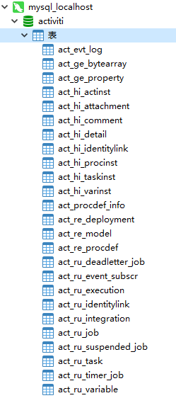

## 学习资料

- 官网：https://www.activiti.org/documentation

- Activiti工作流实战开发：https://xuzhongcn.github.io/activiti/activiti.html

## 概念

**BPM**

Business Process Management，业务流程管理

**BPMN**

Business Process Modeling Notation，业务流程建模标记语言

**BPMS**

Business Process Management Softeware，业务流程管理软件

## 流程绘制工具

常用的有以下几个：

- Eclipse插件
- IDEA插件：Activiti BPMN Visualizer
- Activiti6之前，推荐使用官方Web版离线流程设计器
- Activiti7，推荐使用 https://bpmn.io/

## SpringBoot集成Activiti

1.添加依赖

注意：需要额外添加下面2个依赖：

- *spring-boot-starter-security* ：注入`UserDetailsService`
- *spring-boot-starter-jdbc*：注入`DataSource`

*pom.xml*

```xml
<properties>
    <maven.compiler.source>11</maven.compiler.source>
    <maven.compiler.target>11</maven.compiler.target>
    <project.build.sourceEncoding>UTF-8</project.build.sourceEncoding>

    <spring-boot.version>2.7.18</spring-boot.version>
    <activiti.version>7.1.0.M6</activiti.version>
</properties>

<dependencyManagement>
    <dependencies>
        <dependency>
            <groupId>org.springframework.boot</groupId>
            <artifactId>spring-boot-dependencies</artifactId>
            <version>${spring-boot.version}</version>
            <scope>import</scope>
            <type>pom</type>
        </dependency>
        <!--<dependency>
            <groupId>org.activiti</groupId>
            <artifactId>activiti-dependencies</artifactId>
            <version>${activiti.version}</version>
            <scope>import</scope>
            <type>pom</type>
        </dependency>-->
    </dependencies>
</dependencyManagement>

<dependencies>
    <dependency>
        <groupId>org.springframework.boot</groupId>
        <artifactId>spring-boot-starter-web</artifactId>
    </dependency>
    <dependency>
        <groupId>org.activiti</groupId>
        <artifactId>activiti-spring-boot-starter</artifactId>
        <version>${activiti.version}</version>
    </dependency>
    <dependency>
        <groupId>com.mysql</groupId>
        <artifactId>mysql-connector-j</artifactId>
    </dependency>
    <dependency>
        <groupId>org.springframework.boot</groupId>
        <artifactId>spring-boot-starter-jdbc</artifactId>
    </dependency>
    <dependency>
        <groupId>org.springframework.boot</groupId>
        <artifactId>spring-boot-starter-security</artifactId>
    </dependency>
    <dependency>
        <groupId>org.springframework.boot</groupId>
        <artifactId>spring-boot-starter-test</artifactId>
        <scope>test</scope>
    </dependency>
</dependencies>
```

2.配置

```properties
server.port=18080

spring.datasource.driver-class-name=com.mysql.cj.jdbc.Driver
spring.datasource.url=jdbc:mysql://172.18.116.109:3306/activiti?useSSL=false&serverTimezone=GMT%2B8&allowPublicKeyRetrieval=true
spring.datasource.username=root
spring.datasource.password=root

# 数据库更新策略: true,false,create-drop,drop-create
spring.activiti.database-schema-update=true
spring.activiti.async-executor-activate=true
spring.activiti.check-process-definitions=true
spring.activiti.database-schema=
spring.activiti.deployment-name=SpringAutoDeployment
# 是否开启记录历史数据功能
spring.activiti.db-history-used=true
spring.activiti.history-level=none
```


2.(可选)创建activiti配置文件

*activiti.cfg.xml*

```properties
<?xml version="1.0" encoding="UTF-8"?>
<beans xmlns="http://www.springframework.org/schema/beans"
       xmlns:xsi="http://www.w3.org/2001/XMLSchema-instance"
       xsi:schemaLocation="http://www.springframework.org/schema/beans
       http://www.springframework.org/schema/beans/spring-beans.xsd">

    <bean id="dataSource" class="com.zaxxer.hikari.HikariDataSource" destroy-method="close">
        <property name="jdbcUrl" value="jdbc:mysql://172.18.116.109:3306/activiti?useSSL=false&amp;serverTimezone=Asia/Shanghai&amp;allowPublicKeyRetrieval=true"/>
        <property name="driverClassName" value="com.mysql.cj.jdbc.Driver"/>
        <property name="username" value="root"/>
        <property name="password" value="root"/>
    </bean>

    <bean id="processEngineConfiguration" class="org.activiti.engine.impl.cfg.StandaloneProcessEngineConfiguration">
        <property name="dataSource" ref="dataSource"/>
        <property name="databaseSchemaUpdate" value="true"/>
        <property name="asyncExecutorActivate" value="true"/>
        <property name="dbHistoryUsed" value="true"/>
        <property name="historyLevel" value="NONE"/>
    </bean>
</beans>
```

3.(可选)部署activiti，生成流程相关表

```java
/**
 * 获取流程引擎对象, 自动创建Activiti数据表
 */
@Test
public void testProcessEngine() {
    // ProcessEngine processEngine = ProcessEngines.getDefaultProcessEngine();

    ProcessEngineConfiguration processEngineConfiguration = ProcessEngineConfiguration.createProcessEngineConfigurationFromResource("activiti.cfg.xml");
    ProcessEngine processEngine = processEngineConfiguration.buildProcessEngine();
    String processEngineName = processEngine.getName();
    System.out.println(processEngineName);
}
```

生成Activiti相关数据表



### 流程部署

```java
/**
 * 流程部署(BPMN模型)
 */
@Test
public void testDeployBPMN() {
    ProcessEngine processEngine = ProcessEngines.getDefaultProcessEngine();
    RepositoryService repositoryService = processEngine.getRepositoryService();
    
    Deployment deployment = repositoryService.createDeployment()
        .name("quickstart")
        .addClasspathResource("processes/quickstart.bpmn20.xml")
        .deploy();
    System.out.printf("id=%s, name=%s, time=%s%n", deployment.getId(), deployment.getName(), deployment.getDeploymentTime());
}
```

## 流程信息查询

```java
/**
 * 流程查询信息
 */
@Test
public void testQueryProcesses() {
    ProcessEngine processEngine = ProcessEngines.getDefaultProcessEngine();
    RepositoryService repositoryService = processEngine.getRepositoryService();

    // 查询流程部署信息
    DeploymentQuery deploymentQuery = repositoryService.createDeploymentQuery();
    List<Deployment> deploymentList = deploymentQuery.list();
    for (Deployment deployment : deploymentList) {
        System.out.printf("id=%s, name=%s, deploymentTime=%s%n", deployment.getId(), deployment.getName(), deployment.getDeploymentTime());
    }

    // 查询流程定义信息
    ProcessDefinitionQuery processDefinitionQuery = repositoryService.createProcessDefinitionQuery();
    List<ProcessDefinition> processDefinitionList = processDefinitionQuery.list();
    for (ProcessDefinition processDefinition : processDefinitionList) {
        System.out.printf("id=%s, name=%s, resourceName=%s%n", processDefinition.getId(), processDefinition.getName(), processDefinition.getResourceName());
    }
}
```

## 流程信息删除

```java
/**
 * 流程删除
 * */
@Test
public void testDeleteProcess(){
    ProcessEngine processEngine = ProcessEngines.getDefaultProcessEngine();
    RepositoryService repositoryService = processEngine.getRepositoryService();

    // 删除流程部署信息和流程定义信息
    String deploymentId = "2501";
    repositoryService.deleteDeployment(deploymentId);
}
```


## 启动流程实例


## 查询待办任务

## 审批任务


## 查询已办任务

## 回退任务


## 结束任务