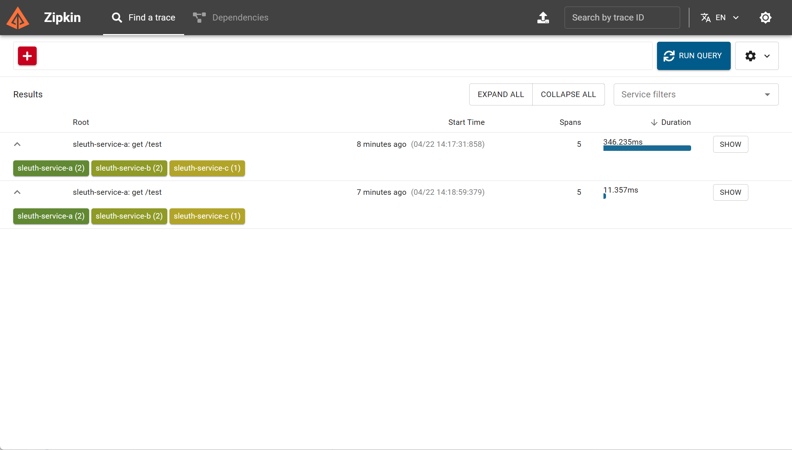
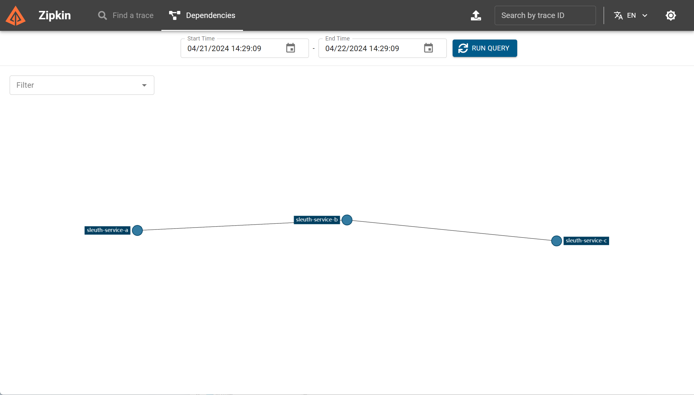

参考：

- https://docs.spring.io/spring-cloud-sleuth/docs/current/reference/html/
- https://zipkin.io/

版本：

- Spring Boot 2.6.13
- Spring Cloud 2021.0.5
- Spring Cloud Alibaba 2021.0.5.0
- spring-cloud-starter-sleuth 3.1.5
- spring-cloud-sleuth-zipkin 3.1.5

 需要注意，Sleuth不支持的Spring Boot 3.x，并且在Spring Cloud 2022.x.x版本的依赖中被移除了。

## 集成Sleuth

添加 spring-cloud-starter-sleuth 依赖即可

```xml
<properties>
    <maven.compiler.source>17</maven.compiler.source>
    <maven.compiler.target>17</maven.compiler.target>

    <spring-boot.version>2.6.13</spring-boot.version>
    <spring-cloud.version>2021.0.5</spring-cloud.version>
</properties>

<dependencies>
    <dependency>
        <groupId>org.springframework.cloud</groupId>
        <artifactId>spring-cloud-starter-sleuth</artifactId>
    </dependency>
</dependencies>
```

Sleuth会自动在日志中添加：**[服务名,Trance ID,Span ID]**

```
INFO [sleuth-service-a,9c4dc316e415c171,9c4dc316e415c171] 25436 --- [io-18080-exec-1] o.a.c.c.C.[Tomcat].[localhost].[/]       : Initializing Spring DispatcherServlet 'dispatcherServlet'
INFO [sleuth-service-a,9c4dc316e415c171,9c4dc316e415c171] 25436 --- [io-18080-exec-1] o.s.web.servlet.DispatcherServlet        : Initializing Servlet 'dispatcherServlet'
INFO [sleuth-service-a,9c4dc316e415c171,9c4dc316e415c171] 25436 --- [io-18080-exec-1] o.s.web.servlet.DispatcherServlet        : Completed initialization in 0 ms

```

## 部署Zipkin服务端

1.下载

https://repo1.maven.org/maven2/io/zipkin/zipkin-server/

2.启动zipkin服务端

`java -jar zipkin-server-3.3.0-exec.jar --server.port=9411`

参数：

- `server.port`：端口，默认9411

3.访问控制台

http://localhost:9411/

## 客户端集成zipkin

1.添加依赖

```xml
<dependency>
    <groupId>org.springframework.cloud</groupId>
    <artifactId>spring-cloud-sleuth-zipkin</artifactId>
</dependency>
```

2.配置

```properties
# 每秒采集日志数量
spring.sleuth.sampler.rate=10
# 日志采样率, 0-1.0
spring.sleuth.sampler.probability=1.0

# zipkin服务地址
spring.zipkin.base-url=http://localhost:9411/
```

3.测试

服务A调用服务B，服务B调用服务C




