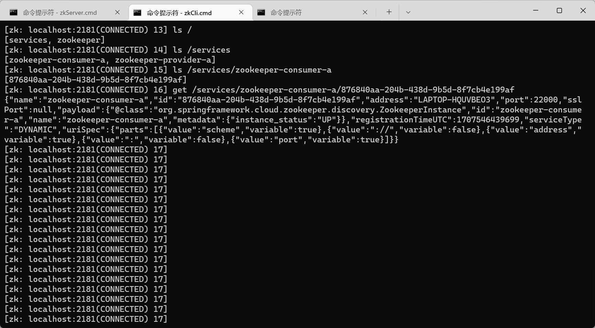

## 参考

- https://spring.io/projects/spring-cloud-zookeeper

## 版本信息：

- Java 17
- Spring Boot 3.0.2
- Spring Cloud 2022.0.0
- Zookeeper 3.6.3

## 注册中心

## 快速开始

1.添加依赖

```xml
<dependency>
    <groupId>org.springframework.cloud</groupId>
    <artifactId>spring-cloud-starter-zookeeper-discovery</artifactId>
</dependency>
```

2.配置

*application.properties*

```properties
server.port=22010
spring.application.name=zookeeper-provider-a

spring.cloud.zookeeper.connect-string=localhost:2181
```

3.启用服务发现

```java
@SpringBootApplication
@EnableDiscoveryClient
public class ZookeeperProviderAApp {
    public static void main(String[] args) {
        SpringApplication.run(ZookeeperProviderAApp.class, args);
    }
}
```

4.验证

启动应用，在ZK Client命令行工具中，查看注册信息

`zkCli.cmd -server 127.0.0.1:2181`



## 配置中心

添加依赖

```xml
<dependency>
    <groupId>org.springframework.cloud</groupId>
    <artifactId>spring-cloud-starter-zookeeper-config</artifactId>
</dependency>
```

