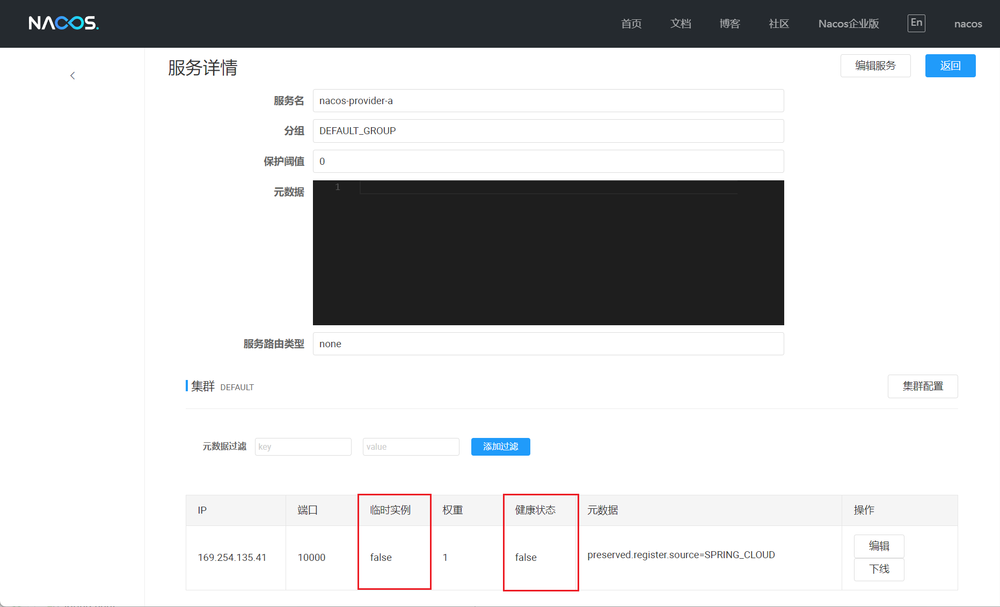

参考：

- https://sca.aliyun.com/zh-cn/docs/next/user-guide/nacos/quick-start
- https://sca.aliyun.com/zh-cn/docs/next/user-guide/nacos/advanced-guide
- https://nacos.io/docs/latest/what-is-nacos/

版本信息：

- nacos 2.2.3
- Spring Cloud Alibaba 2022.0.0.0

## 快速开始

### 1.添加`spring-cloud-starter-alibaba-nacos-discovery`依赖

```xml
<dependency>
    <groupId>com.alibaba.cloud</groupId>
    <artifactId>spring-cloud-starter-alibaba-nacos-discovery</artifactId>
</dependency>
```

### 2.配置Nacos

在配置文件中配置Nacos注册中心地址，如果开启了鉴权，需要配置用户名和密码

```properties
server.port=9001
spring.application.name=nacos-provider-a

spring.cloud.nacos.server-addr=127.0.0.1:8848
spring.cloud.nacos.username=nacos
spring.cloud.nacos.password=nacos

spring.cloud.nacos.discovery.server-addr=${spring.cloud.nacos.server-addr}
spring.cloud.nacos.discovery.username=${spring.cloud.nacos.username}
spring.cloud.nacos.discovery.password=${spring.cloud.nacos.password}
```

### 3.使用注解`@EnableDiscoveryClient`启用服务发现

> 可选，添加依赖后自动启用服务发现

```java
@SpringBootApplication
@EnableDiscoveryClient
public class NacosProviderAApp {
    public static void main(String[] args) {
    	SpringApplication.run(NacosProviderAApp.class, args);
    }
}
```

启动应用，可以在Nacos控制台的服务列表中看到，注册成功


### 4.服务发现

使用`@EnableDiscoveryClient`启用服务发现后，自动注入`DiscoveryClient`类型的Bean，可跟注册中心进行通信，例如查询服务注册信息。

```java
@RestController
@RequestMapping("/consumer-a")
public class TestController {

    @Resource private DiscoveryClient discoveryClient;

    @GetMapping("/instances")
    public String instances() {
        StringBuilder builder = new StringBuilder();

        List<String> services = discoveryClient.getServices();
        for(String serviceId : services) {
            builder.append(String.format("服务: %s\n", serviceId));
            List<ServiceInstance> instances = discoveryClient.getInstances(serviceId);
            for(ServiceInstance instance : instances) {
                builder.append(String.format("\t实例: id=%s %s:%s\n", instance.getInstanceId(), instance.getHost(), instance.getPort()));
            }
        }

        return builder.toString();
    }
}
```

启动应用，访问 http://localhost:9001/provider-a/instances

```
服务: nacos-provider-a
	实例: id=null 169.254.135.41:9001
服务: nacos-consumer-a
	实例: id=null 169.254.135.41:9000
```

### 5.调用远程服务

在服务提供者应用中，定义一个接口，供服务消费者调用

```java
@RestController
@RequestMapping("/provider-a")
public class TestController {

    @GetMapping("/hello")
    public String hello(@RequestParam String name){
        return String.format("hello, %s !!!", name);
    }
}
```

在服务消费者应用中，手动注入一个`RestTemplate`类型的Bean，用来发送HTTP请求

```java
@Configuration
public class RestTemplateConfig {

    @Bean
    public RestTemplate restTemplate(){
        return new RestTemplate();
    }
}
```

然后定义1个接口，使用`DiscoveryClient`查询远程服务的IP和端口，用`RestTemplate`发送HTTP请求

```java
@RestController
@RequestMapping("/consumer-a")
public class TestController {

    @Resource private DiscoveryClient discoveryClient;
    @Resource private RestTemplate restTemplate;

    @GetMapping("/hello")
    public String hello(@RequestParam String name) {
        String serviceId = "nacos-provider-a";
        ServiceInstance instance = discoveryClient.getInstances(serviceId)
                                                  .stream()
                                                  .findAny()
                                                  .orElseThrow(() -> new RuntimeException("服务" + serviceId + "不可用"));

        return restTemplate.getForObject("http://{host}:{port}/provider-a/hello?name={name}", String.class, 
                                         instance.getHost(), instance.getPort(), name);
    }
}

```

启动应用，访问 http://localhost:9000/consumer-a/hello?name=tom

```
hello, tom !!!
```

## 集成LoadBalancer

### 1.添加`spring-cloud-starter-loadbalancer`依赖

```xml
<dependency>
    <groupId>org.springframework.cloud</groupId>
    <artifactId>spring-cloud-starter-loadbalancer</artifactId>
</dependency>
```

### 2.在配置中启用Nacos负载均衡

```properties
spring.cloud.loadbalancer.enabled=true
spring.cloud.loadbalancer.nacos.enabled=true
```

### 3.使用`@LoadBalanced`标记`RestTemplate`

> 如果使用OpenFeign，`FeignClient`默认已集成负载均衡功能

```java
@Configuration
public class RestTemplateConfig {

    @Bean
    @LoadBalanced
    public RestTemplate restTemplate(){
        return new RestTemplate();
    }
}
```

### 验证

在服务提供者应用中，定义接口，返回当前实例的端口号

```java
@RestController
@RequestMapping("/provider-a")
public class TestController {

    @Value("${server.port}")
    private String port;

    @GetMapping("/port")
    public String port(){
        return String.format("port: %s", port);
    }
}
```

启动服务提供者应用的2个实例：分别使用JVM参数`-Dserver.port=9001`和`-Dserver.port=9002`启动

在服务消费者中，使用`RestTemplate`发送HTTP请求，使用服务ID代替IP和端口

```java
@RestController
@RequestMapping("/consumer-a")
public class TestController {
	@GetMapping("/port")
    public String port(){
        return restTemplate.getForObject("http://{serviceId}/provider-a/port", String.class, "nacos-provider-a");
    }
}
```

启动应用，请求 http://localhost:9000/consumer-a/port，可以发现，客户端负载均衡生效。

## 权重

指定服务提供者实例的权重：配合负载均衡使用，权重越大，负载的流量越大。默认1

```properties
spring.cloud.nacos.discovery.weight=1
```

## 临时实例和持久实例

服务实例注册到Nacos时，默认为临时实例，服务退出时，自动从Nacos删除。

设置为false表示注册为持久实例

```properties
spring.cloud.nacos.discovery.ephemeral=false
```

持久实例即使退出，也不会从Nacos删除，必须手动调用OpenAPI的 /nacos/v2/ns/instance 端点注销实例



注销实例

```
localhost:8848/nacos/v2/ns/instance?namespaceId=public&groupName=DEFAULT_GROUP&serviceName=nacos-consumer-a&ip=169.254.135.41&port=10000&clusterName=clusterName&accessToken=<ACCESS_TOKEN>
```

## 使用命名空间和分组

指定服务实例命名空间和分组：服务实例将注册到指定的命名空间和分组，当前服务实例从指定的命名空间和分组获取微服务注册信息。

> 命名空间默认值public，分组默认值DEFAULT_GROUP

```properties
spring.cloud.nacos.discovery.namespace=public
spring.cloud.nacos.discovery.group=DEFAULT_GROUP
```

## 使用集群

指定集群名称，默认DEFAULT

```properties
spring.cloud.nacos.discovery.cluster-name=DEFAULT
```

## 支持IPv4和IPv6注册

默认同时启用IPv4和IPv6，可以配置只启用其中1种

```properties
# IPv4,IPv6
spring.cloud.nacos.discovery.ip-type=IPv4
```

## 其它配置项

其它配置项及其默认值

```properties
# 是否启用服务发现
spring.cloud.nacos.discovery.enabled=true
# 服务名
spring.cloud.nacos.discovery.service=${spring.application.name}
```

