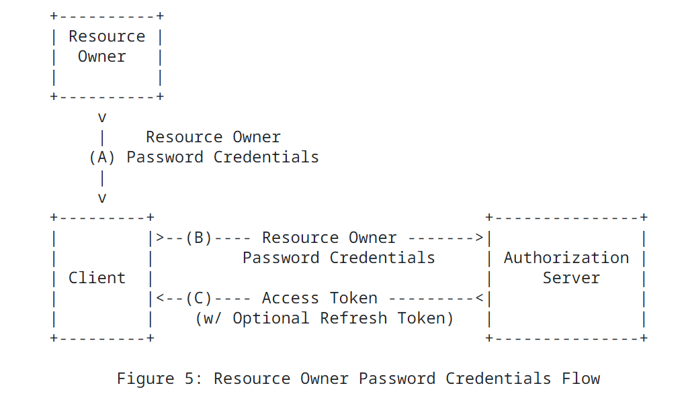

## OAuth2.0授权框架

参考资料：

+ RFC6749：https://datatracker.ietf.org/doc/html/rfc6749
+ OpenID Connect 1.0：https://openid.net/specs/openid-connect-core-1_0.html

### 4个角色

OAuth定义了4个角色：

1. 资源拥有者(resource owner)，一般指用户
2. 资源服务器(resource server)，托管受保护资源的服务器，客户端需要通过访问令牌请求资源
3. 客户端(client)
4. 授权服务器(authorization server)，向客户端颁发令牌的服务器

### OAuth协议流程

A.客户端要求资源所有者进行授权

B.资源所有者向客户端授权，返回授权凭据（具体取决于使用4种授权类型中的哪一种）

C.客户端使用上一步的授权信息，向授权服务器请求访问令牌

D.授权服务器验证客户端身份，并颁发令牌给客户端

E.客户端使用访问令牌请求资源服务器中受保护的资源

F.资源服务器验证访问令牌，并返回受保护的资源给客户端

### 4种授权模式

**1.授权码模式(Authorization Code)**

**2.隐式授权模式(Implicit)**

**3.密码模式(Resource Owner Password Credentials)**

**4.客户端凭证模式(Client Credentials)**

### 访问令牌

### 刷新令牌

# OpenID Connect 1.0
