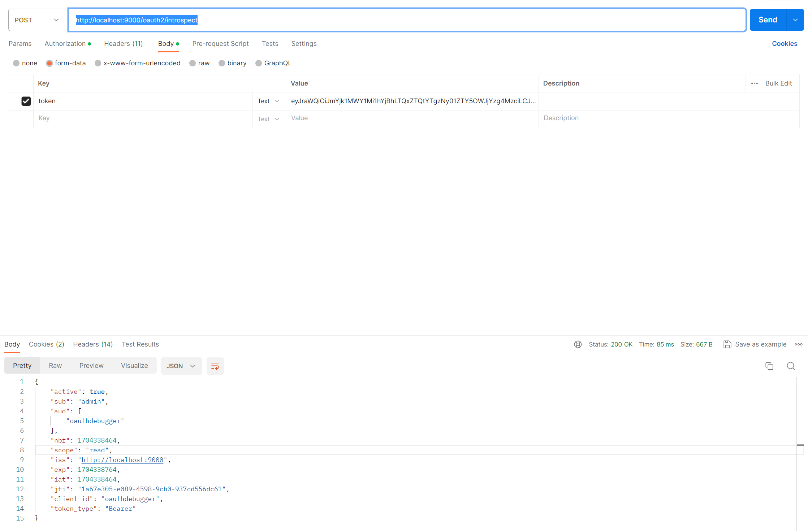
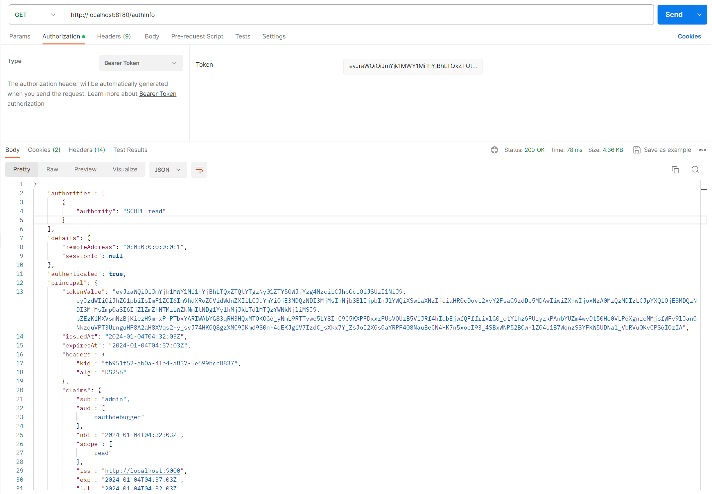
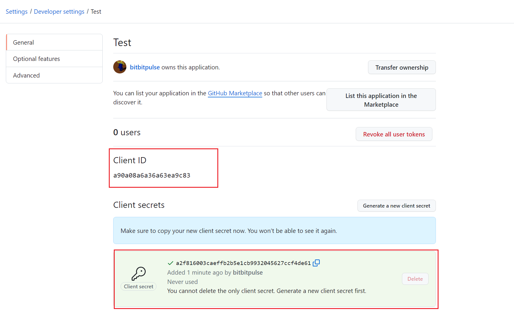
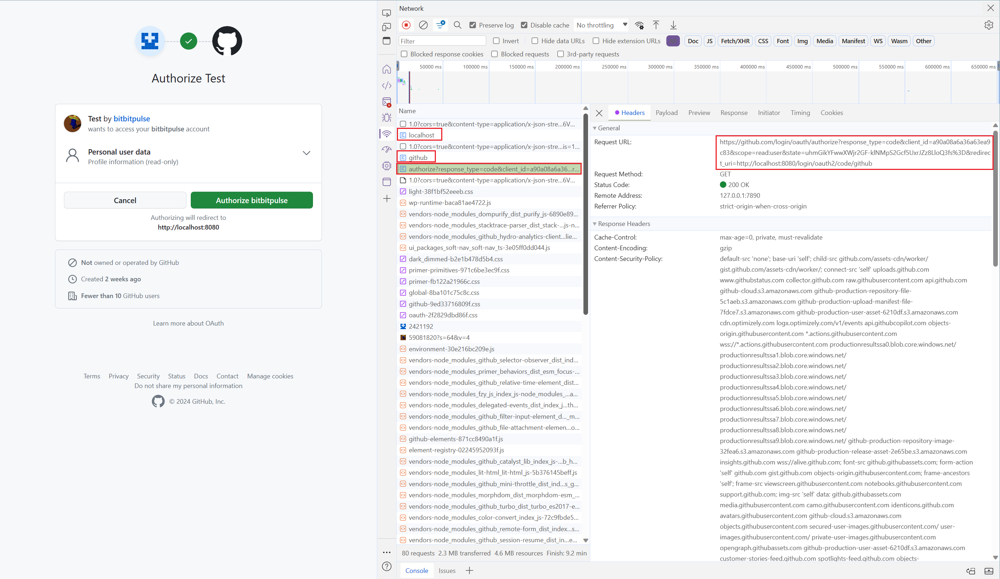

参考资料：

+ https://docs.spring.io/spring-authorization-server/reference/index.html

+ https://docs.spring.io/spring-security/reference/servlet/oauth2/index.html

+ https://spring.io/guides/tutorials/spring-boot-oauth2


版本信息：

- JDK 17
- Spring Boot 3.2.1
- Spring Authorization Server 1.2.1
- Spring Securiy OAuth2 Resource Server 6.2.1
- Spring Securiy OAuth2 Client 6.2.1

## OAuth2授权服务器

### 依赖

```xml
<dependency>
    <groupId>org.springframework.boot</groupId>
    <artifactId>spring-boot-starter-oauth2-authorization-server</artifactId>
</dependency>
```

### 创建授权服务器配置类

**使用默认配置**

可以直接使用 `OAuth2AuthorizationServerConfiguration` 配置类。

默认配置自动注入了一个 `SecurityFilterChain` Bean，并设置了授权服务器的一些端点。

```java
@Configuration
@EnableWebSecurity
@Import(OAuth2AuthorizationServerConfiguration.class)
public class SecurityConfig {
    
}
```

或者手动调用 `OAuth2AuthorizationServerConfiguration#applyDefaultSecurity` 方法，然后获取 `OAuth2AuthorizationServerConfigurer` 配置对象进行自定义。

> 推荐使用这种配置方式

```java
@Configuration
@EnableWebSecurity
public class SecurityConfig {

    @Bean
    @Order(1)
    public SecurityFilterChain authorizationServerSecurityFilterChain(HttpSecurity http) throws Exception {
        OAuth2AuthorizationServerConfiguration.applyDefaultSecurity(http);

        OAuth2AuthorizationServerConfigurer authServerConfigurer = http.getConfigurer(OAuth2AuthorizationServerConfigurer.class);
        // 自定义配置

        return http.build();
    }

    @Bean
    @Order(2)
    public SecurityFilterChain defaultSecurityFilterChain(HttpSecurity http) throws Exception {
        http.authorizeHttpRequests(authorize -> authorize.anyRequest()
                                                         .authenticated());
        http.formLogin(Customizer.withDefaults());
        return http.build();
    }
}
```

**自定义配置**

创建 `OAuth2AuthorizationServerConfigurer` 对象，使用其对授权服务器进行自定义

```java
@Configuration
@EnableWebSecurity
public class SecurityConfig {

    @Bean
    public SecurityFilterChain authorizationServerSecurityFilterChain(HttpSecurity http) throws Exception {
        OAuth2AuthorizationServerConfigurer oAuth2AuthorizationServerConfigurer = new OAuth2AuthorizationServerConfigurer();

        http.with(oAuth2AuthorizationServerConfigurer, authorizationServer -> {
			
        });

        http.authorizeHttpRequests(authorize -> authorize.anyRequest().authenticated());
        http.csrf(csrf -> csrf.disable());
        
        return http.build();
    }
}
```

### 实现一个最基础的授权服务器

**配置**

```java
@Configuration
@EnableWebSecurity
public class SecurityConfig {

    /**
     * 授权服务器Filter链
     * */
    @Bean
    @Order(1)
    public SecurityFilterChain authorizationServerSecurityFilterChain(HttpSecurity http) throws Exception {
        OAuth2AuthorizationServerConfiguration.applyDefaultSecurity(http);

        OAuth2AuthorizationServerConfigurer authServerConfigurer = http.getConfigurer(OAuth2AuthorizationServerConfigurer.class);
        authServerConfigurer.oidc(Customizer.withDefaults()); // OIDC;

        // 未授权时, 重定向到登录页
        http.exceptionHandling(exception -> exception.defaultAuthenticationEntryPointFor(new LoginUrlAuthenticationEntryPoint("/login"), new MediaTypeRequestMatcher(MediaType.TEXT_HTML)));
        return http.build();
    }
    
    /**
     * 普通请求Filter链
     * */
    @Bean
    @Order(2)
    public SecurityFilterChain defaultSecurityFilterChain(HttpSecurity http) throws Exception {
        http.authorizeHttpRequests(authorize -> authorize.anyRequest()
                                                         .authenticated());
        http.formLogin(Customizer.withDefaults());
        return http.build();
    }
    
    /**
     * 保存, 查询已注册的客户端
     */
    @Bean
    public RegisteredClientRepository registeredClientRepository() {
        RegisteredClient debuggerClient = RegisteredClient.withId(UUID.randomUUID().toString())
                                                   .clientId("oauthdebugger")
                                                   .clientSecret("$2a$10$cRyCiTevh3FtPx6RicEcoO74HL.98e1vUvwoR9yLJwPuFydZPs/me") // oauthdebugger
                                                   .clientAuthenticationMethod(ClientAuthenticationMethod.CLIENT_SECRET_BASIC) // 认证方式: Basic
                                                   .authorizationGrantType(AuthorizationGrantType.AUTHORIZATION_CODE) // 授权方式: 授权码
                                                   .redirectUri("https://oauthdebugger.com/debug") // 客户端认证成功重定向URL
                                                   .postLogoutRedirectUri("https://oauthdebugger.com") // 客户端退出登录重定向URL
                                                   .scope("read")
                                                   .build();

        return new InMemoryRegisteredClientRepository(debuggerClient);
    }
    
    /**
     * 配置授权服务器
     */
    @Bean
    public AuthorizationServerSettings authorizationServerSettings() {
        return AuthorizationServerSettings.builder()
                                          .build();
    }

    /**
     * 配置客户端
     */
    @Bean
    public ClientSettings clientSettings() {
        return ClientSettings.builder()
                             .requireAuthorizationConsent(true)
                             .requireProofKey(false)
                             .build();
    }
    
    /**
     * 配置Token
     */
    @Bean
    public TokenSettings tokenSettings() {
        return TokenSettings.builder()
                            .build();
    }
    
    /**
     * JWKSource,用于签署令牌
     * */
    @Bean
    public JWKSource<SecurityContext> jwkSource() {
        KeyPair keyPair = generateRsaKey();
        RSAPublicKey publicKey = (RSAPublicKey) keyPair.getPublic();
        RSAPrivateKey privateKey = (RSAPrivateKey) keyPair.getPrivate();
        RSAKey rsaKey = new RSAKey.Builder(publicKey).privateKey(privateKey)
                                                     .keyID(UUID.randomUUID().toString())
                                                     .build();
        JWKSet jwkSet = new JWKSet(rsaKey);
        return new ImmutableJWKSet<>(jwkSet);
    }

    private static KeyPair generateRsaKey() {
        KeyPair keyPair;
        try {
            KeyPairGenerator keyPairGenerator = KeyPairGenerator.getInstance("RSA");
            keyPairGenerator.initialize(2048);
            keyPair = keyPairGenerator.generateKeyPair();
        } catch(NoSuchAlgorithmException ex) {
            throw new IllegalStateException(ex);
        }
        return keyPair;
    }

    /**
     * 令牌解码器
     * */
    @Bean
    public JwtDecoder jwtDecoder(JWKSource<SecurityContext> jwkSource){
        return OAuth2AuthorizationServerConfiguration.jwtDecoder(jwkSource);
    }


    @Bean
    public UserDetailsService userDetailsService() {
        UserDetails admin = User.builder()
                                .username("admin")
                                .password("$2a$10$2DRHwzwFv5ZHQhs4RqDG5eFi4wzuu/VzY9.lLfrfWOl/Ao.R9Z7vm")
                                .roles("USER", "ADMIN")
                                .build();
        return new InMemoryUserDetailsManager(admin);
    }

    @Bean
    public PasswordEncoder passwordEncoder() {
        return new BCryptPasswordEncoder();
    }
}
```

**查看授权服务器元素据**

GET http://localhost:9000/.well-known/oauth-authorization-server

```json
{
    "issuer": "http://localhost:9000",
    "authorization_endpoint": "http://localhost:9000/oauth2/authorize",
    "device_authorization_endpoint": "http://localhost:9000/oauth2/device_authorization",
    "token_endpoint": "http://localhost:9000/oauth2/token",
    "token_endpoint_auth_methods_supported": [
        "client_secret_basic",
        "client_secret_post",
        "client_secret_jwt",
        "private_key_jwt"
    ],
    "jwks_uri": "http://localhost:9000/oauth2/jwks",
    "response_types_supported": [
        "code"
    ],
    "grant_types_supported": [
        "authorization_code",
        "client_credentials",
        "refresh_token",
        "urn:ietf:params:oauth:grant-type:device_code"
    ],
    "revocation_endpoint": "http://localhost:9000/oauth2/revoke",
    "revocation_endpoint_auth_methods_supported": [
        "client_secret_basic",
        "client_secret_post",
        "client_secret_jwt",
        "private_key_jwt"
    ],
    "introspection_endpoint": "http://localhost:9000/oauth2/introspect",
    "introspection_endpoint_auth_methods_supported": [
        "client_secret_basic",
        "client_secret_post",
        "client_secret_jwt",
        "private_key_jwt"
    ],
    "code_challenge_methods_supported": [
        "S256"
    ]
}
```

**测试**

OAuth2测试工具网站：

+ https://oauthdebugger.com/

+ https://oidcdebugger.com/

请求授权服务器认证端点


授权服务器自动重定向到登录页面，要求进行登录认证


输入用户名、密码，登录成功后，授权服务器会自动重定向到注册客户端时配置的回调URL，这里是 https://oauthdebugger.com/debug，并将授权码code作为URL参数拼接到回调URL上


根据授权码获取Token


校验Token



取消授权(使Token失效)


## OAuth2资源服务器

### 依赖

```xml
<dependency>
    <groupId>org.springframework.boot</groupId>
    <artifactId>spring-boot-starter-oauth2-resource-server</artifactId>
</dependency>
```

### 实现一个最简单的资源服务器

**创建SpringBoot应用**

创建启动引导类，application配置文件如下

```properties
server.port=8180

logging.level.org.springframework.security.oauth2=trace

spring.security.oauth2.resourceserver.jwt.issuer-uri=http://localhost:9000
```

**创建配置类**

```java
@Configuration
@EnableWebSecurity
public class SecurityConfig {

    @Value("${spring.security.oauth2.resourceserver.jwt.issuer-uri}") private String iss;

    @Bean
    public SecurityFilterChain securityFilterChain(HttpSecurity http) throws Exception {
        JwtDecoder jwtDecoder = JwtDecoders.fromIssuerLocation(iss);
        http.oauth2ResourceServer(resourceServer -> resourceServer.jwt(jwt -> jwt.decoder(jwtDecoder))); // JWT解码器

        http.authorizeHttpRequests(authorize -> authorize.anyRequest()
                                                         .authenticated());
        return http.build();
    }
}
```

**添加一个测试Controller**

```java
@RestController
public class HelloController {

    @GetMapping("/authInfo")
    public Authentication hello(Authentication authentication){
        return authentication;
    }
}
```

**测试**

从授权服务器获取一个token，设置到Authoization请求头中，请求 http://localhost:8180/authInfo



## OAuth2客户端

### 依赖

```xml
<dependency>
    <groupId>org.springframework.boot</groupId>
    <artifactId>spring-boot-starter-oauth2-client</artifactId>
</dependency>
```


## OAuth2客户端登录

### github

**1.在github中注册客户端，获取clientId和clientSecret**

https://github.com/settings/applications/new




**2.配置客户端注册信息**

通过配置文件的方式

```properties
server.port=8080

spring.security.oauth2.client.registration.github.client-id=a90a08a6a36a63ea9c83
spring.security.oauth2.client.registration.github.client-secret=a2f816003caeffb2b5e1cb9932045627ccf4de61
```

通过配置类的方式

> 关于Github OAuth相关的配置信息参考Github文档：
>
> https://docs.github.com/en/apps/oauth-apps/building-oauth-apps/authorizing-oauth-apps

```java
@Configuration
@EnableWebSecurity
public class SecurityConfig {

    @Bean
    public SecurityFilterChain securityFilterChain(HttpSecurity http) throws Exception {
        http.authorizeHttpRequests(authorize -> authorize.anyRequest()
                                                            .authenticated());

        http.oauth2Login(Customizer.withDefaults());
        return http.build();
    }

    @Bean
    public ClientRegistrationRepository clientRegistrationRepository() {
        return new InMemoryClientRegistrationRepository(githubClientRegistration());
    }

    private ClientRegistration githubClientRegistration() {
        return ClientRegistration.withRegistrationId("github")
                                 .clientId("a90a08a6a36a63ea9c83")
                                 .clientSecret("a2f816003caeffb2b5e1cb9932045627ccf4de61")
                               .clientAuthenticationMethod(ClientAuthenticationMethod.CLIENT_SECRET_BASIC)
                                 .authorizationGrantType(AuthorizationGrantType.AUTHORIZATION_CODE)
                                 .redirectUri("{baseUrl}/login/oauth2/code/{registrationId}")
                                 .authorizationUri("https://github.com/login/oauth/authorize")
                                 .tokenUri("https://github.com/login/oauth/access_token")
                                 .userInfoUri(" https://api.github.com/user")
                                 .userNameAttributeName("id")
                                 .scope("read:user")
                                 .clientName("Github")
                                 .build();
        					   .build();
    }
}
```

实际上，SpringSecurity默认提供了一个 `CommonOAuth2Provider` 类，其中定义了注册到常见的第三方认证服务器（Google, GitHub, Facebook, and Okta）的配置信息。

注册到Giuhub可以这么写

```java
private ClientRegistration githubClientRegistration() {
    return CommonOAuth2Provider.GITHUB.getBuilder("github")
        .clientId("a90a08a6a36a63ea9c83")
        .clientSecret("a2f816003caeffb2b5e1cb9932045627ccf4de61")
        .build();
```

**3.测试**

浏览器访问 http://localhost:8080/，会发生以下请求：

1. 客户端返回302，Location为

   http://localhost:8080/oauth2/authorization/github

2. 客户端返回302，Location为

   https://github.com/login/oauth/authorize?response_type=code&client_id=a90a08a6a36a63ea9c83&scope=read:user&state=uhmGikYFwwXWjr2GF-klNMpS2Gcf5UxrJZz8LloQ3fs%3D&redirect_uri=http://localhost:8080/login/oauth2/code/github

3. 浏览器自动重定向到github认证页面

​	

