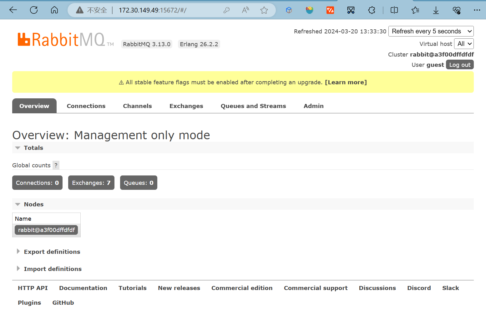

版本：

+ RabbitMQ 3.12.12

参考：

+ https://rabbitmq.com/download.html

## Windows

## Linux

## Docker

镜像地址：https://hub.docker.com/_/rabbitmq/

1.下载镜像

`docker pull rabbitmq:3`

2.创建容器

`docker create --name myrabbit -p 5672:5672 -p 15672:15672 -e RABBITMQ_DEFAULT_USER=guest -e RABBITMQ_DEFAULT_PASS=guest -e RABBITMQ_DEFAULT_VHOST=/ rabbitmq:3`

参数：

+ *-p 5672:5672*，RabbitMQ的AMQP端口映射
+ *-p 15672:15672*，RabbitMQ管理控制台端口映射
+ *-e RABBITMQ_DEFAULT_USER=guest -e RABBITMQ_DEFAULT_PASS=guest* ，RabbitMQ管理控制台用户名和密码，默认guest/guset
+ *-e RABBITMQ_DEFAULT_VHOST=/*，RabbitMQ vHost，默认 /

3.启动容器

`docker start myrabbit`

4.查看容器启动日志

`docker logs myrabbit`

5.启用RabbitMQ管理插件

进入容器

`docker exec -it myrabbit bash`

启动插件

`rabbitmq-plugins enable rabbitmq_management`

6.访问RabbitMQ控制台

在浏览器中访问：http://localhost:15672/，输入用户名和密码（guest/guest）

